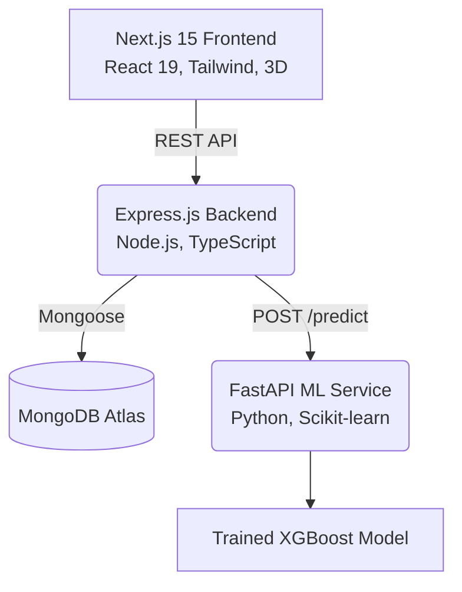

# 🏡 AirbnbAI - Smart Rental Marketplace

**AirbnbAI** is a massive, enterprise-grade, end-to-end B.Tech CSE Final Year Project that revolutionizes the property rental market by integrating advanced Machine Learning for dynamic price prediction.

It features a robust **Microservices Architecture** with a Next.js 15 Frontend, an Express.js/MongoDB Backend API, and a FastAPI/XGBoost Machine Learning service.

## 🔴 Live Demo
- **Live Application:** [https://airbnb-price-prediction-npqjnsf3l.vercel.app](https://airbnb-price-prediction-npqjnsf3l.vercel.app)

## 🚀 Key Features

### 🧠 Artificial Intelligence (ML Service)
- **Predictive Pricing Engine**: Utilizes XGBoost Regressor trained on thousands of Airbnb data points (Latitude, Longitude, Room Type, Property Type, Amenities, etc.) to predict the optimal nightly price for a property.
- **Synthetic Data Generation**: Automated script to generate 5,000+ realistic Airbnb property datasets for training.
- **FastAPI Integration**: Ultra-fast RESTful endpoint (`/predict`) for real-time model inference.

### 🎨 Premium Frontend Experience
- **Next.js 15 App Router**: Fully optimized React 19 application.
- **Procedural 3D Hero Section**: A stunning, auto-rotating 3D house model built with React Three Fiber (`@react-three/fiber`) and Drei.
- **Glassmorphism & Dark Mode**: Modern, luxury aesthetic featuring blurred backgrounds, gradient meshes, and glowing borders.
- **Buttery Smooth Animations**: Powered by `Framer Motion` and `Lenis` smooth scrolling.
- **Interactive Dashboards**: Role-based (Host/Guest) dashboards with real-time charting using `Recharts`.

### 🛡️ Secure Backend API
- **Node.js & Express**: Scalable backend architecture.
- **MongoDB & Mongoose**: Complex relational schemas for Users, Properties, and Bookings.
- **JWT Authentication**: Secure, role-based access control (Admin, Host, Guest).
- **Dummy Payment Gateway architecture**: Integrated booking endpoints that calculate total prices and mock payment status.

---

## 🏗️ Architecture Diagram



---

## 🛠️ Setup & Installation

### Prerequisites
- Node.js (v18+)
- Python (3.9+)
- MongoDB instance running

### 1. Setup ML Service (FastAPI)
```bash
cd ml-service
python -m venv venv
# Activate venv (Windows: venv\Scripts\activate, Mac/Linux: source venv/bin/activate)
pip install -r requirements.txt
python generate_data.py # Generates synthetic data and trains the XGBoost model
uvicorn main:app --reload --port 8000
```

### 2. Setup Backend API (Express)
```bash
cd backend
npm install
# Create a .env file and add MONGODB_URI and JWT_SECRET
npm run build
npm run start # Or npm run dev
```

### 3. Setup Frontend (Next.js)
```bash
cd frontend
npm install
npm run dev
```
Navigate to `http://localhost:3000` to view the stunning 3D Landing Page!

---

## 📂 Project Structure
```text
AirbnbAI/
├── frontend/             # Next.js 15, Tailwind, Three.js, Framer Motion
│   ├── src/app/          # Pages (Landing, Login, Register, Dashboard)
│   ├── src/components/   # 3D Models, Charts, Layouts
├── backend/              # Node.js, Express, TypeScript
│   ├── src/models/       # Mongoose Schemas (User, Property, Booking)
│   ├── src/controllers/  # Business Logic & ML Service Integration
│   ├── src/routes/       # Express Routes
├── ml-service/           # FastAPI, Python, Scikit-Learn
│   ├── generate_data.py  # Data Synthesis & XGBoost Training Script
│   ├── main.py           # FastAPI Prediction Endpoint
│   ├── models/           # Pickled XGBoost Models & Scalers
```

## 🎓 Conclusion
AirbnbAI is a comprehensive showcase of modern full-stack development combined with Applied Machine Learning, designed to mirror the technical complexity of a million-dollar startup.
